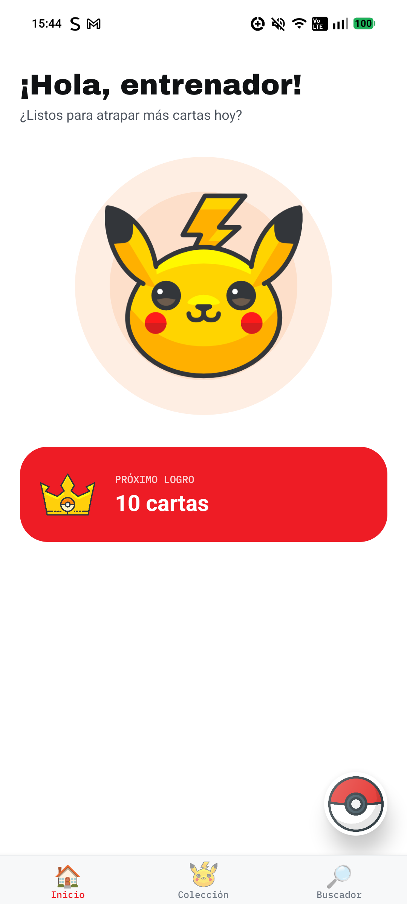
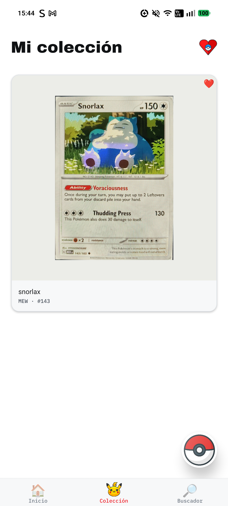
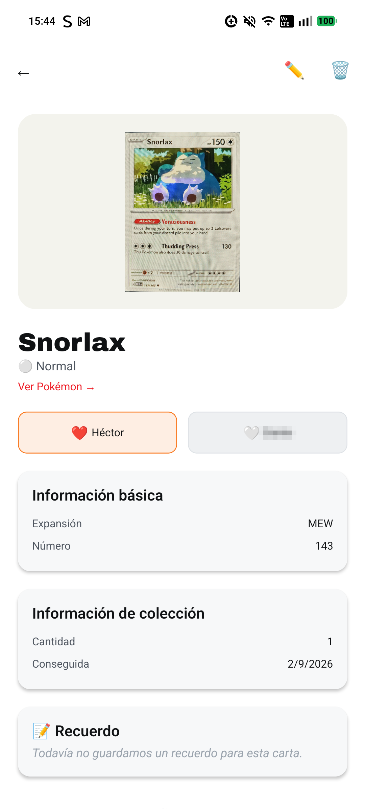

# PokeV 🃏

App móvil personal para llevar el álbum de cartas Pokémon de mi hijo y mío — un álbum digital que celebra lo que ya tenemos.

<table align="center">
  <tr>
    <td align="center">
       
      <b>Inicio</b>
    </td>
    <td align="center">
       
      <b>Mi colección</b>
    </td>
    <td align="center">
       
      <b>Detalle de carta</b>
    </td>
  </tr>
</table>

## Por qué existe

La mayoría de apps de colección están pensadas para coleccionistas adultos que buscan "completar" algo — porcentajes, listas de lo que falta, la Pokédex nacional entera. Para un niño eso se siente como una meta imposible. PokeV hace lo contrario: la Pokédex solo muestra los Pokémon que ya descubrieron por tener una carta propia, y el progreso se celebra en hitos ("¡Ya tenemos 100 cartas!"), nunca en lo que falta.

## Features

- 🃏 Álbum de colección con cantidad, favoritas y recuerdos por carta
- 🔎 Buscador de cartas contra el catálogo real (TCGdex) — explorar sin presión de completar nada
- 📖 Pokédex propia: solo los Pokémon que aparecen en la colección
- 🏆 Logros por hitos de colección y descubrimiento (nunca "cuántas faltan")
- 👨‍👦 Favoritas independientes por entrenador (papá / hijo / ambos)
- 📷 Escaneo de cartas por foto con IA
- 📱 Widget de Android: carta favorita del día, que se "voltea" al tocarla

## Stack

React Native · TypeScript · Zustand · TanStack Query · react-native-android-widget

> API en NestJS + PostgreSQL: **[pokev_backend](https://github.com/Hector0122/pokev_backend)**

## Aviso legal

Proyecto personal, sin fines comerciales, para uso exclusivo de mi hijo y yo — no está afiliado, respaldado ni asociado con Nintendo, Game Freak, Creatures Inc. ni The Pokémon Company. "Pokémon" y los nombres/imágenes de las cartas son marcas y derechos de autor de sus respectivos dueños. Los datos de Pokémon y cartas se consultan en vivo desde [PokeAPI](https://pokeapi.co/) y [TCGdex](https://tcgdex.dev/).

## Licencia

MIT (código propio) — ver [LICENSE](LICENSE). No cubre marcas ni contenido de Pokémon.
